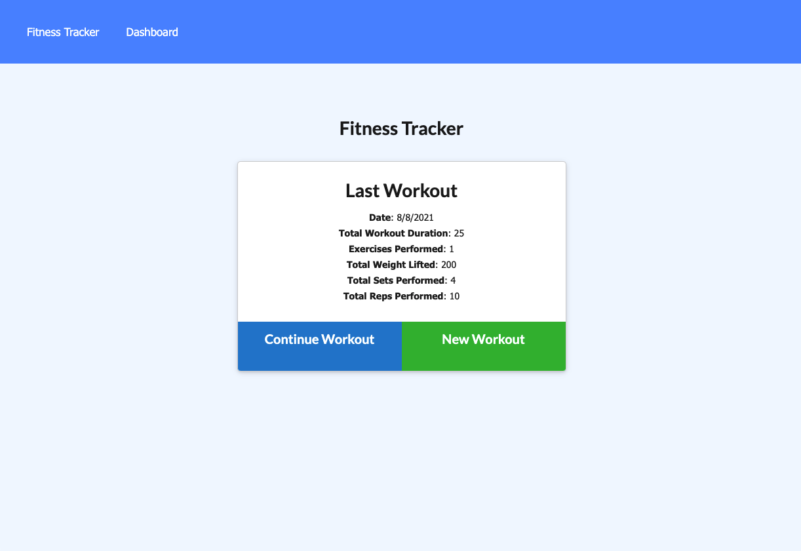
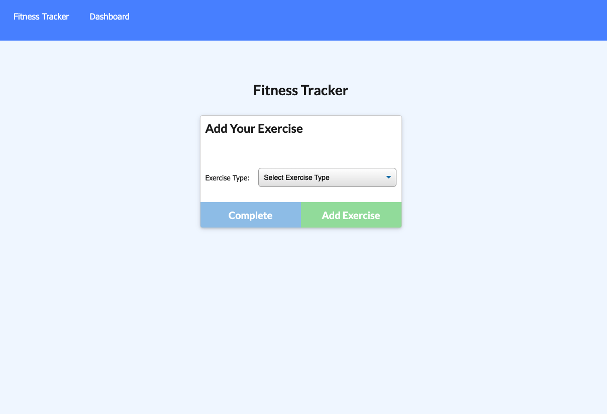
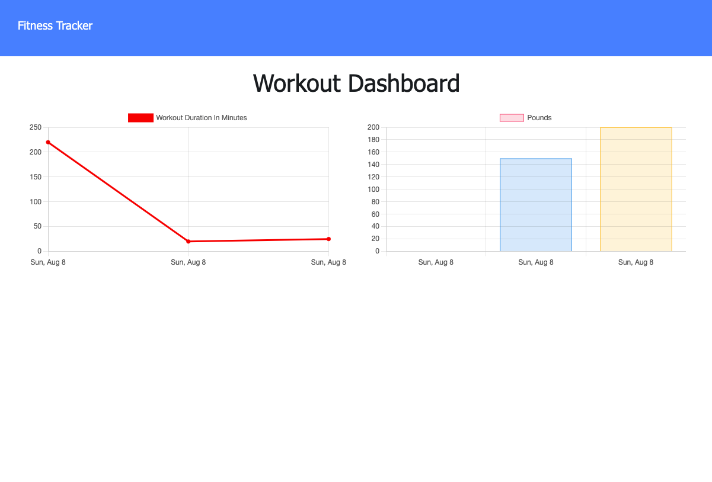

# Workout Tracker

## Description
A web application to help a user keep track of workout logs and data.
## Table of contents
* [Installation](#installation)
* [Usage](#usage)
* [Deploy link](#deploy)
## Installation
No need to install anything, please go to the deploy link to use application.
## Usage
Once you click the link you will be taken to the front page, in the middle of the page there will be stats on the last logged exercise, it will also give you and option to add a new exercise to the previous workout or start a completely new workout session log.

Once you chose, you will be presented a forum to fill out on your new exercise.
 
The dashboard option will present you data on your past logged workouts.
 
## Deploy
[Heroku Deployment](https://serene-plains-29080.herokuapp.com/)
